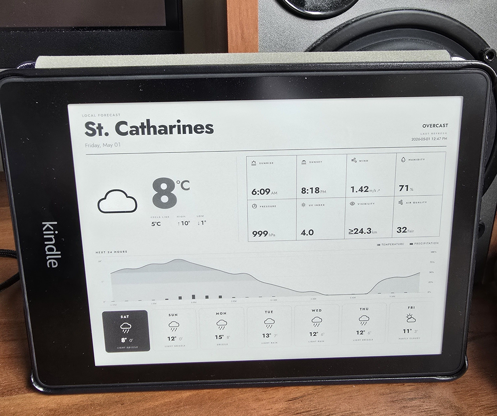
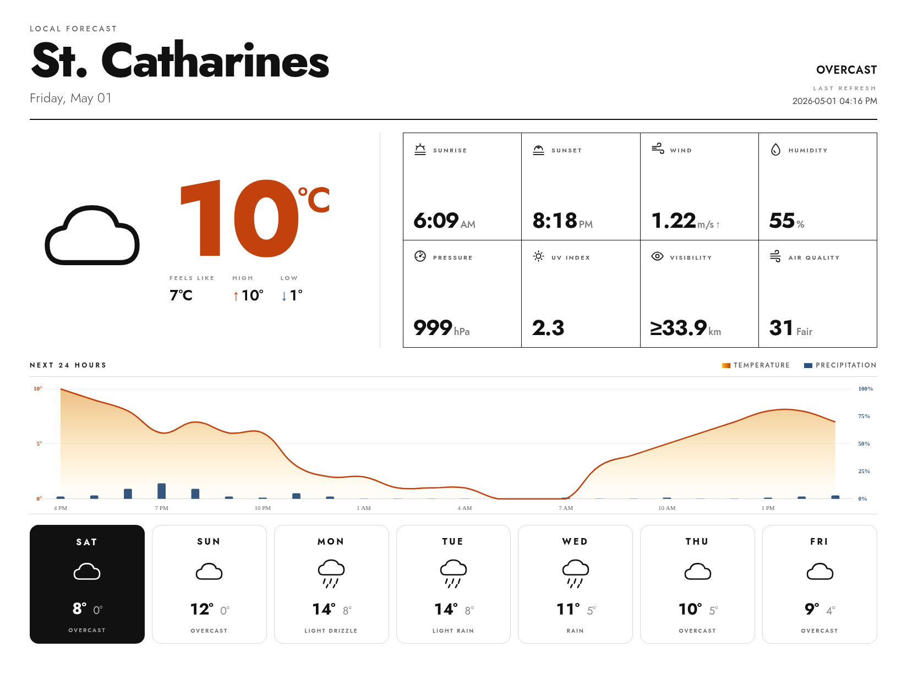

# Kindle Weather Dashboard (with Kindle PW5)

After lots of school projects, I was left with a raspberry pi 4 board. When cleaning my room I also found my old Kindle so I think I should do something fun with it. This is a little project to turn both of them into a always-on weather dashboard.




## Overview

The Pi fetches weather data, renders it as an HTML page, screenshots it with Chromium, and serves the image as a PNG. The Kindle, which is jailbroken, runs a shell script that wakes up every so often, grabs the PNG from the Pi, slaps it on the screen with `eips`, then goes back to sleep.

Here is what each side is doing:

**Raspberry Pi (server)**
- Pulls weather and AQI data from Open-Meteo (free, no API key needed)
- Renders a Jinja2 HTML template into a weather dashboard
- Screenshots it with headless Chromium, then post-processes with Pillow (crop, resize, grayscale, rotate for e-ink orientation)
- Serves the final image at `/weather.png` via Flask/Gunicorn on port 5000
- Regenerates the image every 30 minutes through a cron job

**Kindle (client)**
- A booklet script runs on the Kindle
- Fetches `/weather.png` from the Pi with `curl`
- Displays it full-screen with `eips`
- Sleeps, then repeats

Everything is configured through a settings page the Pi serves, so you don't have to touch config files if you don't want to.


## Prerequisites

**Raspberry Pi**
- Any Pi that can run Python 3 and headless Chromium should work
- Python 3 with `pip`
- `chromium` available on the command line (or `chromium-browser` on older OS)

**Kindle**
- I tested this on a Kindle Paperwhite 5 (PW5) with firmware 5.18.3, but it should work on any Kindle with firmware versions that can be jailbroken with WinterBreak or AdBreak
- Jailbreak guide: https://kindlemodding.org/jailbreaking/AdBreak/
- KUAL (Kindle Unified Application Launcher) installed after jailbreaking

## (Optional) SSH access to the Kindle

I use SSH copy the booklet script over, or kill the process when something goes wrong. There are a few ways to do this depending on your setup:

**Option A: Tailscale (what I use - good if your network has client isolation)**

My place's network has client isolation, so I went with Tailscale. You can follow these guides to get it running on the Kindle via KUAL:
- https://tailscale.com/blog/tailscale-jailbroken-kindle
- https://github.com/mitanshu7/tailscale_kual

Start it in Proxy Mode (SOCKS5/HTTP) so the Kindle can reach the Pi through the Tailscale network.

**Option B: USBNetLite (simpler, works over USB)**

- https://github.com/notmarek/kindle-usbnetlite

**Option C: USBNetwork (for older Kindle models)**

- https://wiki.mobileread.com/wiki/USBNetwork

## Installation

### 1. Clone the repo

```bash
git clone <repo-url>
cd weather-dashboard-kindle
```

### 2. Set up a virtual environment and install dependencies

```bash
python3 -m venv venv
source venv/bin/activate
pip install flask gunicorn requests pillow
```

### 3. Configure the dashboard

Once the server is running (next step), open `http://<pi-ip>:5000` in a browser. There is an interactive map picker to set your location, plus options for units, display size, refresh interval, and so on.

If you'd rather just edit the file directly, here is what `config.json` looks like:

```json
{
  "city": "Your City",
  "latitude": 0.0,
  "longitude": 0.0,
  "units": "metric",
  "width": 1648,
  "height": 1236,
  "refresh_interval": 30,
  "time_format": "12h",
  "forecast_days": 7
}
```

Or you can just keep the `config.json` intact if you also live in St. Catharines like me :)

### 4. Start the server

```bash
./run.sh
```

This starts Gunicorn on port 5000, adds a cron job to regenerate the image every 30 minutes, and fires off an initial generation right away. Press Ctrl+C to shut it down - the cron job gets cleaned up automatically.

### 5. Deploy the booklet to the Kindle

Copy the script over to your Kindle:

```bash
scp kindle/weather-dashboard.sh root@<kindle-ip>:/mnt/us/documents/weather-dashboard.sh
```

Or just use USB if you don't have SSH access to Kindle. Just place the script inside Kindle's `documents` folder (`/mnt/us/documents`)

Then the script will show as a booklet. That's it - it'll start fetching and displaying the image on its own.


## Troubleshooting
If something goes wrong, you can SSH into the Kindle to kill the process. Or just do a reboot (hold power button) and it should be back to the GUI.

## License

MIT License


## Acknowledgments

- [Open-Meteo](https://open-meteo.com/) - free weather API, no key needed
- [Leaflet.js](https://leafletjs.com/) - powers the interactive map in the settings page
- [Nominatim](https://nominatim.org/) - used for reverse geocoding to auto-fill the city name
- [kindle-dash-client](https://github.com/samkhawase/kindle-dash-client) by samkhawase - what got me started on the Kindle client side
- The Kindle jailbreak community at [kindlemodding.org](https://kindlemodding.org/)
- [Tailscale](https://tailscale.com/)